# 🔐 Launcher Bot Pesca Habbo Origins

Este proyecto proporciona un entorno seguro basado en máquina virtual para ejecutar herramientas automatizadas en Habbo Origins, incluyendo cifrado/descifrado de imágenes, validación de licencias, y ejecución encapsulada con QEMU.

---

## 🧰 Componentes Clave

| Componente                 | Descripción |
|---------------------------|-------------|
| `mv.py`                   | Lanzador principal con GUI para validar licencia y descifrar la VM |
| `index.py`                | Wrapper que ejecuta `mv.exe` como administrador y limpia QEMU |
| `validador_licencia.py`   | Módulo que valida la clave con la API y descarga imagen cifrada |
| `descifrador_img.py`      | Descifra `.img` usando AES CBC y añade clave local |
| `cifrar_img.py`           | Utilidad para cifrar una imagen `.img` original |
| `.env`                    | Contiene URL de API y clave de acceso |
| `3ZuxE7bre0kypSqM76n5dkak7zZBu0` | Archivo `.img` cifrado AES |
| `mv.exe`                  | Versión compilada de `mv.py` (opcional) |

---

## 🔐 Validación de Licencia

El acceso está restringido por una API REST que valida claves personales.

**.env**

```env
API_URL=http://144.91.110.153/validar
API_KEY=LCklg5H2zMm0ULuMfvX9gqPKHXAiQg3bbA3dXURHk0M
```

---

## 🔄 Actualización Automática

- La imagen cifrada se descarga desde un endpoint protegido.
- Se verifica el `timestamp` y `size` contra un archivo local de control para evitar redundancia.
- La descarga se realiza con barra de progreso visible.

---

## 🧊 Máquina Virtual

### Ejecutada con QEMU:

```bash
qemu-system-x86_64 -m 2048 -smp 2 -hda <imagen_descifrada.img> -net nic -net user -accel whpx -display sdl
```

### Requisitos:

- QEMU instalado (https://qemu.weilnetz.de/)
- HypervisorPlatform habilitado:

```powershell
Enable-WindowsOptionalFeature -Online -FeatureName HypervisorPlatform -All
```

---

## 🛠 Proceso General

```mermaid
graph TD
  A[Usuario] -->|Ejecuta| B[mv.py]
  B -->|GUI| C[Validación de licencia]
  C -->|Valida contra API| D[Servidor Flask]
  C -->|Si válido| E[Descarga y descifrado IMG]
  E -->|Verifica fingerprint| F[Seguridad]
  F -->|Inicia VM con QEMU| G[Entorno virtual seguro]
```



---

## 🧪 Encriptado Manual

Para cifrar una imagen nueva:

```bash
python cifrar_img.py
# Usa AES CBC con IV aleatorio
```

---

## 🧼 Limpieza Automática

`index.py` y `mv.py` limpian:

- Imagen descifrada temporal
- Archivos `.lock`
- Carpeta FAT virtual
- Archivos de control `.tmp`

---

## 🧩 NGROK (opcional)

Para exponer localmente tu servidor Flask a Internet:

```bash
ngrok config add-authtoken TU_TOKEN
ngrok http 5000
```

Luego reemplaza `API_URL` por tu dominio ngrok.

---

## 📦 Compilación

Compilar `mv.py` o `index.py` con PyInstaller:

```bash
pyinstaller --noconsole --onefile mv.py
```

---

## 📌 Notas Finales

- Funciona en sistemas Windows 64-bit con QEMU y soporte Hyper-V.
- El uso no autorizado o distribución de claves está restringido.
- Todo el sistema opera bajo verificación y cifrado.

